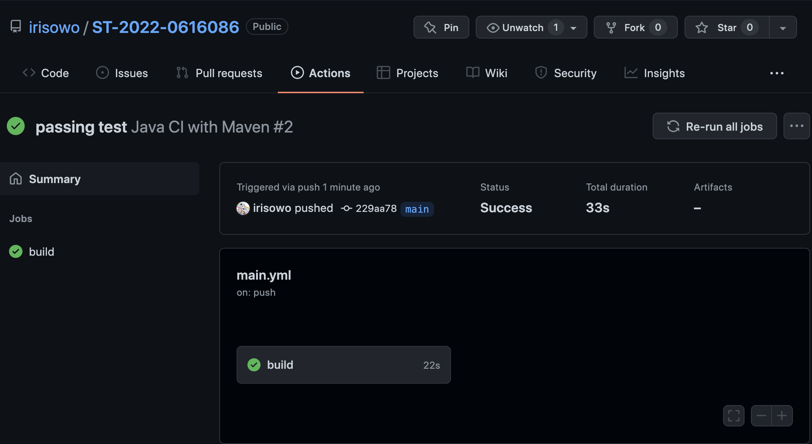
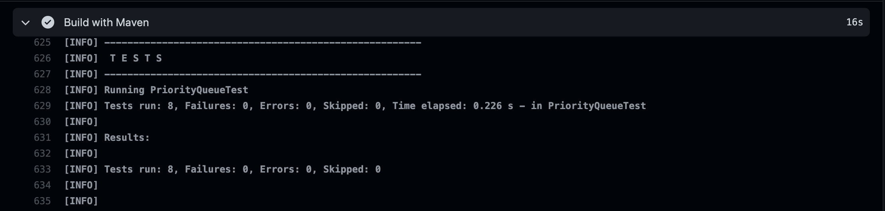
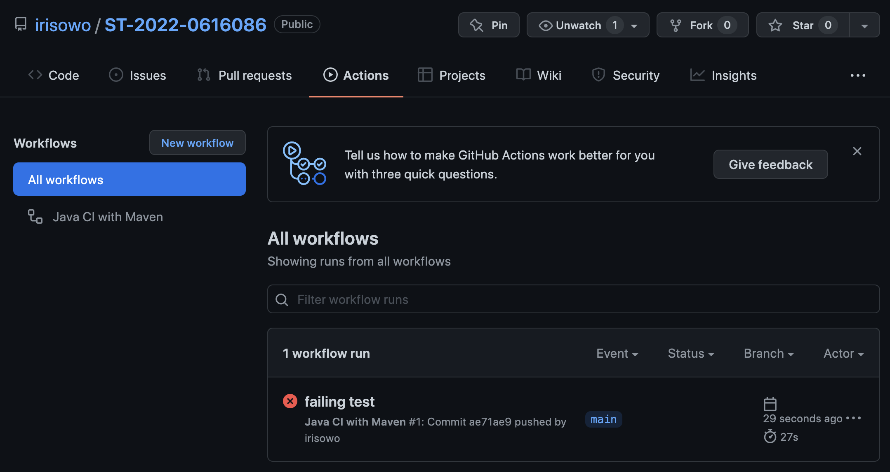
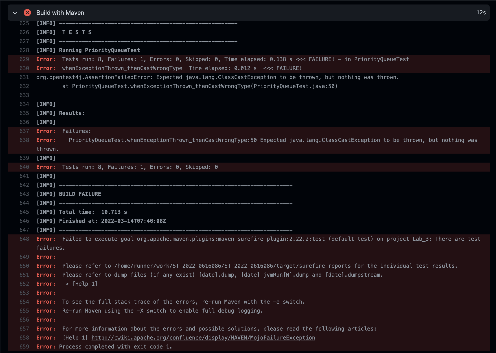

# NYCU-Software-Testing-2022-Lab_3


## Pass
* 
* 

## Fail
* 
* 

## Spec
* Test java.util.PriorityQueue class with Junit.
    * import java.util.PriorityQueue;
* Parameterization
    * Testcase : { random array } , { correct array }.
    * Random array specifies your own input array.
    * Correct array means the PriorityQueue polling correct order instead of using toArray().
    * There are 5 unique testcases.
* Exception
    * There are 3 unique Exceptions thrown by PriorityQueue.
        1. IllegalArgumentException
            * whenExceptionThrown_thenInitialCapacityNotGreaterThanOne()
        2. NullPointerException
            * whenExceptionThrown_thenOfferEisNull()
        3. ClassCastException
            * whenExceptionThrown_thenCastWrongType()
            * Success case : 
                * ```
                   Exception exception = assertThrows(ClassCastException.class, () -> {
                    PriorityQueue pq = new PriorityQueue();
                    pq.add(0);
                    pq.add('0');
                    });             
                    ```
            * Failure case : 
                * ```
                   Exception exception = assertThrows(ClassCastException.class, () -> {
                    PriorityQueue pq = new PriorityQueue();
                    pq.add(0);
                    pq.add(0);
                    });             
                    ```